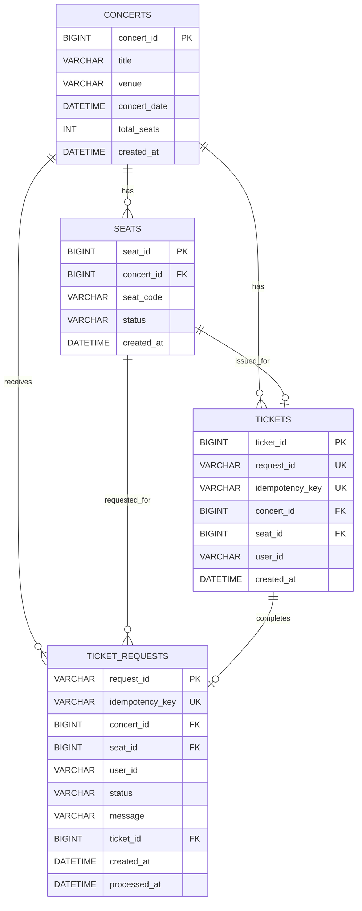

# ERD

작성일: 2026-05-28

## 범위

최종 백엔드 DB 구조이다. Redis hold와 SQS/Lambda 결제 확정 흐름을 기준으로 하고, RDS 직접 예매 실험용 API도 같은 테이블을 사용한다.

## Mermaid ERD

Mermaid Live Editor에 붙여넣을 때는 ```mermaid와 ``` 줄을 제외하고 `erDiagram`부터 복사한다.



## 테이블 요약

### concerts

공연 정보를 저장한다.

| 컬럼 | 설명 |
|---|---|
| concert_id | 공연 ID, PK |
| title | 공연명 |
| venue | 장소 |
| concert_date | 공연 일시 |
| total_seats | 전체 좌석 수 |
| created_at | 생성 시각 |

### seats

좌석의 최종 판매 상태를 저장한다.

| 컬럼 | 설명 |
|---|---|
| seat_id | 좌석 ID, PK |
| concert_id | 공연 ID, FK |
| seat_code | 좌석 코드. 예: A-1, B-1 |
| status | 좌석 최종 상태. `AVAILABLE`, `SOLD` |
| created_at | 생성 시각 |

제약조건:

```text
UNIQUE(concert_id, seat_code)
```

### tickets

최종 예매 성공 내역을 저장한다.

| 컬럼 | 설명 |
|---|---|
| ticket_id | 티켓 ID, PK |
| request_id | 요청 ID, UNIQUE |
| idempotency_key | 중복 처리 방지 키, UNIQUE |
| concert_id | 공연 ID, FK |
| seat_id | 좌석 ID, FK |
| user_id | 사용자 ID |
| created_at | 생성 시각 |

제약조건:

```text
UNIQUE(request_id)
UNIQUE(idempotency_key)
UNIQUE(concert_id, seat_id)
```

### ticket_requests

SQS/Lambda 결제 확정 요청의 처리 상태를 저장한다.

| 컬럼 | 설명 |
|---|---|
| request_id | 요청 ID, PK |
| idempotency_key | 중복 처리 방지 키, UNIQUE |
| concert_id | 공연 ID, FK |
| seat_id | 좌석 ID, FK |
| user_id | 사용자 ID |
| status | `PENDING`, `PROCESSING`, `SUCCESS`, `FAILED` |
| message | 처리 메시지 |
| ticket_id | 성공 시 생성된 티켓 ID |
| created_at | 생성 시각 |
| processed_at | 처리 완료 시각 |

## 주요 규칙

- DB에는 `HOLD`를 저장하지 않는다.
- Redis hold는 임시 상태이고, 최종 판매 여부는 `seats.status = 'SOLD'`가 기준이다.
- RDS 직접 예매 실험용 API는 `seats` 조건부 UPDATE와 `tickets` unique constraint로 중복 예매를 막는다.
- 최종 결제 확정 흐름은 `ticket_requests`에 `PENDING`으로 저장하고 SQS/Lambda가 최종 반영한다.
