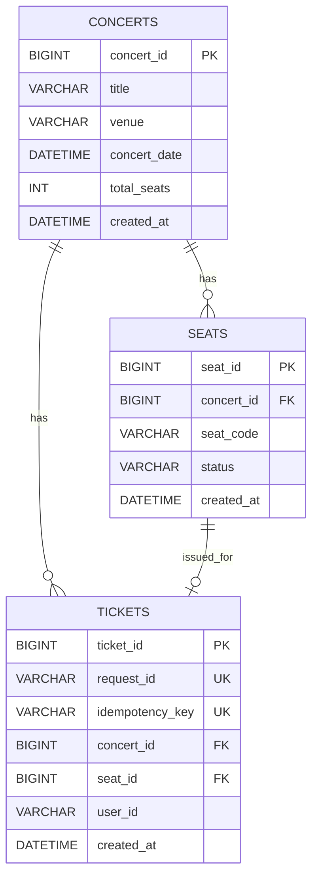

# ERD

수정일: 2026-05-15

## Mermaid ERD



## 테이블

### concerts

| 컬럼         | 설명         |
| ------------ | ------------ |
| concert_id   | 공연 ID, PK  |
| title        | 공연명       |
| venue        | 장소         |
| concert_date | 공연 일시    |
| total_seats  | 전체 좌석 수 |
| created_at   | 생성 시각    |

### seats

| 컬럼       | 설명                           |
| ---------- | ------------------------------ |
| seat_id    | 좌석 ID, PK                    |
| concert_id | 공연 ID, FK                    |
| seat_code  | 좌석 코드. 예: A-1, B-1        |
| status     | 좌석 상태. `AVAILABLE`, `SOLD` |
| created_at | 생성 시각                      |

제약조건:

```text
UNIQUE(concert_id, seat_code)
```

### tickets

| 컬럼            | 설명                      |
| --------------- | ------------------------- |
| ticket_id       | 티켓 ID, PK               |
| request_id      | 요청 ID, UNIQUE           |
| idempotency_key | 중복 처리 방지 키, UNIQUE |
| concert_id      | 공연 ID, FK               |
| seat_id         | 좌석 ID, FK               |
| user_id         | 사용자 ID                 |
| created_at      | 생성 시각                 |

제약조건:

```text
UNIQUE(request_id)
UNIQUE(idempotency_key)
UNIQUE(concert_id, seat_id)
```

## 주요 규칙

- 좌석 최종 판매 여부는 `seats.status = 'SOLD'`가 기준이다.
- 중복 예매는 `seats` 조건부 UPDATE와 `tickets` unique constraint로 막는다.
